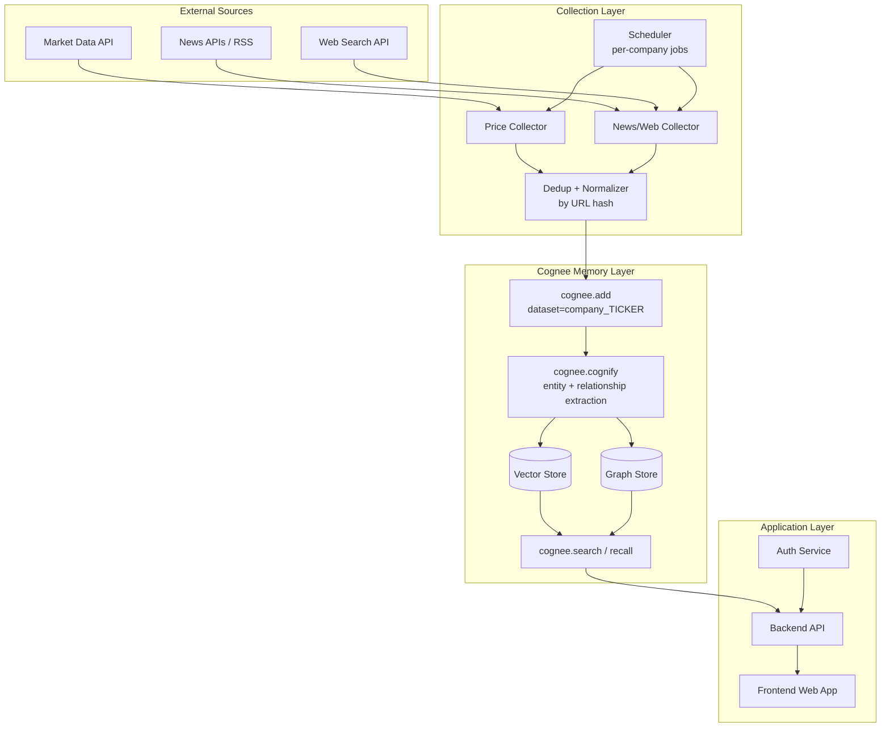
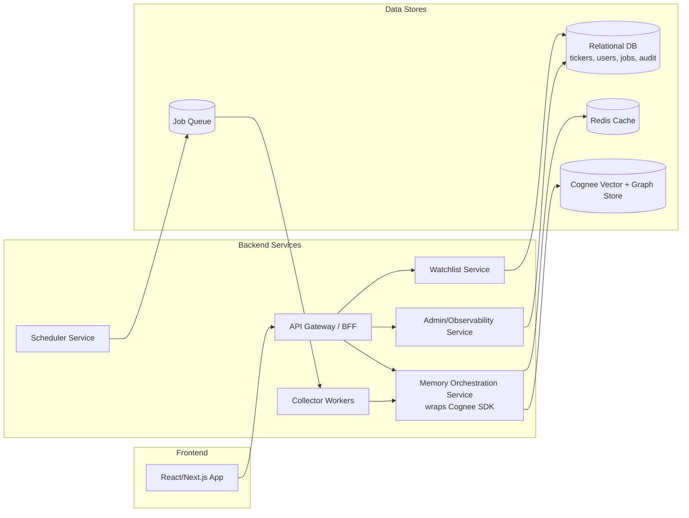
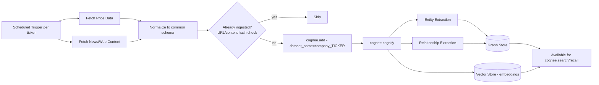
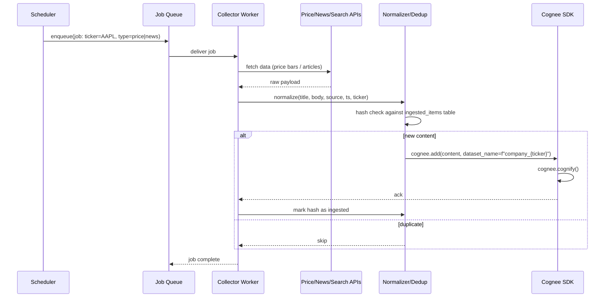
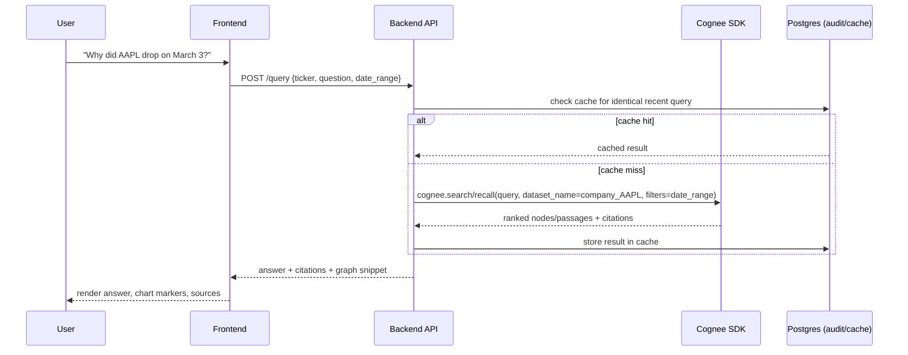
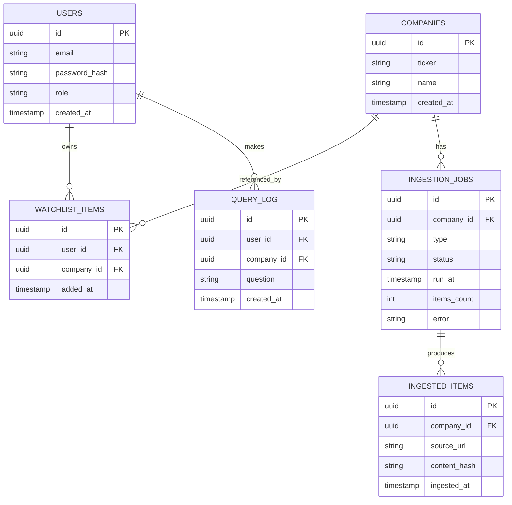
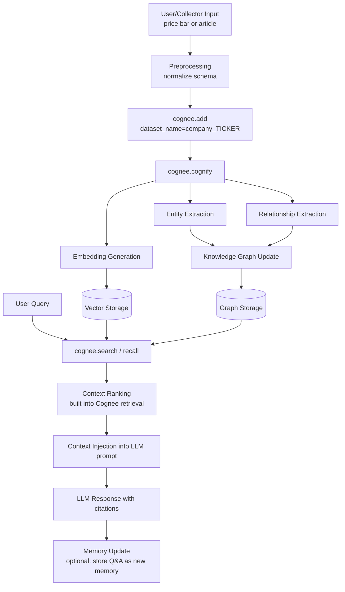
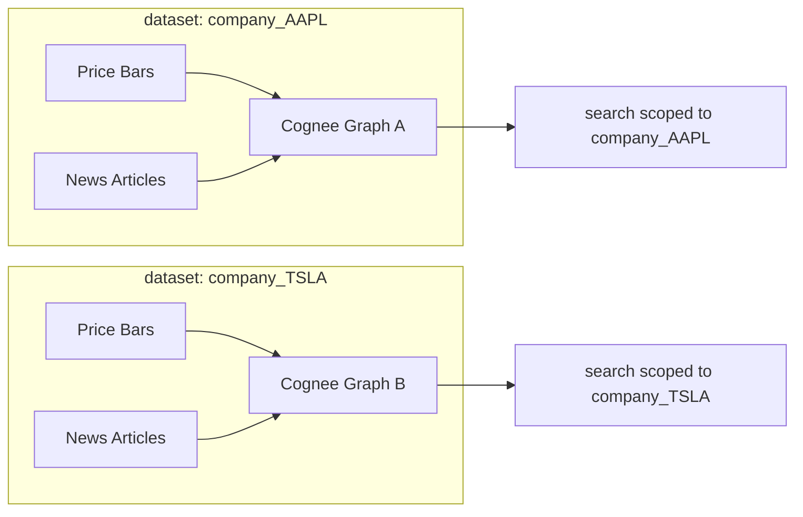
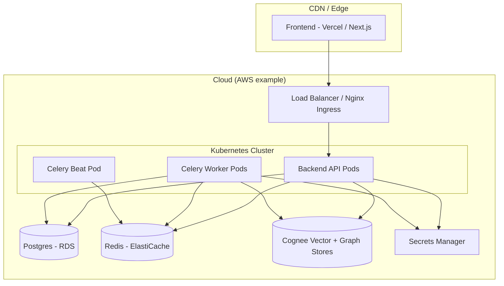

# Cognivest — Software Architecture Document (SAD)

### Per-Company Financial Intelligence Platform powered by Cognee

> This document is the **single source of truth** for the system design. All code, structure, and
> conventions in this repository derive from it. When in doubt, this document wins.

---

## 1. Project Understanding

### 1.1 Executive Summary

Cognivest is a financial intelligence platform that continuously gathers two streams of data per
publicly traded company — **structured price data** and **unstructured web/news content** — and feeds
both into **Cognee** as the unified memory layer. Cognee owns ingestion (`add()`), knowledge-graph
construction (`cognify()`), and retrieval (`search()` / `recall()`). There is no bespoke "recall layer"
or "summarization stage" built on top of it: Cognee's pipeline already performs entity extraction,
relationship extraction, embedding, and graph linking, and the application layer is a thin orchestration
+ presentation shell around it.

### 1.2 Problem Statement

Investors, analysts, and retail users need a single place where price action and qualitative narrative
(news, filings commentary, social/web chatter) about a company are correlated automatically — e.g.,
*"price dropped 8% on March 3rd; what happened?"* Today this requires manually cross-referencing price
charts with disparate news sources. Most tools either show price *or* news, rarely a graph that links
the two causally/temporally.

### 1.3 Goals

- Continuously and automatically collect price + broad web/news content per company (per-ticker).
- Use Cognee as the single source of truth for memory: ingestion, graph building, and querying, with no
  duplicate "summarizer" service.
- Allow users to ask natural-language questions scoped to a company and date range and receive cited,
  ranked answers.
- Scope memory per company (multi-tenant-by-ticker) so graphs don't bleed across companies.
- Be production-ready: dedup, scheduling, observability, security — not a notebook script.

### 1.4 Target Users

- Retail/active investors researching specific tickers.
- Analysts who want a fast "what happened and why" view.
- Internal tools/teams that want a queryable financial knowledge graph as a building block.

### 1.5 Primary Use Cases

1. *"Why did $TICKER move today?"* — correlate a price delta with same-day/adjacent-day news.
2. *"Summarize the last 30 days of news for $TICKER."* — graph + vector retrieval, ranked, cited.
3. *"What entities (people, products, competitors, regulators) are most connected to $TICKER right now?"* — graph traversal.
4. Scheduled per-company ingestion running unattended, scaling to hundreds/thousands of tickers.
5. Backfill / historical ingestion for a newly added ticker.

### 1.6 Functional Requirements

- **FR1**: Add a company (ticker) to the watchlist → triggers collector registration + initial backfill.
- **FR2**: Collector pulls price data on a schedule (e.g., end-of-day, or intraday) and writes to a structured store + Cognee dataset.
- **FR3**: Collector pulls news/web content per company on a schedule (e.g., every 1–4 hours) via APIs/search, dedupes, normalizes, and calls `cognee.add()`.
- **FR4**: After each ingestion batch, `cognee.cognify()` runs (sync or async) to extract entities/relationships and update the per-company graph.
- **FR5**: Users can query via `cognee.search()` / `recall()` scoped by `dataset_name` (company) and optional date range; results are ranked and cited back to source URLs.
- **FR6**: System surfaces price chart + correlated news markers in the UI.
- **FR7**: Admin can view ingestion health (last run, item counts, errors) per company.

### 1.7 Non-Functional Requirements

- **Scalability**: support 1,000+ tickers with independent ingestion schedules.
- **Reliability**: collector failures for one company must not block others (isolation, retries, dead-letter queue).
- **Latency**: query responses (search/recall) target < 3s p95 for typical scoped queries.
- **Cost control**: avoid re-cognifying duplicate content; cache embeddings; rate-limit external API calls.
- **Compliance**: respect source ToS — prefer licensed APIs/search over raw scraping.
- **Observability**: structured logs + metrics for every pipeline stage.

### 1.8 Engineering Assumptions

- Cognee is used as a managed library/service inside the backend (self-hosted, using its configured vector + graph DB backends) rather than reimplementing graph/vector logic.
- "Price data" comes from a market-data API (e.g., Polygon/IEX/Alpha Vantage-class provider) — vendor left pluggable.
- "Broad web/news" is sourced via a combination of structured news APIs (NewsAPI-class, GDELT), RSS feeds from financial outlets, and a web-search API (Tavily/Serper-class) run with per-company queries — **not** unrestricted scraping.
- Cognee's default vector store and graph store are used (LanceDB/Weaviate-class vector backend, Neo4j/Kuzu-class graph backend) — exact backend is a Cognee configuration choice, abstracted from the app.
- One Cognee `dataset` per company (`dataset_name=f"company_{ticker}"`), so graphs are isolated and queries are naturally scoped.
- Authentication is required only for the application layer (users/admins), not for Cognee itself, which is treated as an internal service.

---

## 2. System Architecture

### 2.1 High-Level Architecture



### 2.2 Component Diagram



### 2.3 Data Flow Diagram



### 2.4 Sequence Diagram — Scheduled Ingestion



### 2.5 Sequence Diagram — User Query



### 2.6 Service Communication

- **Synchronous**: Frontend ↔ Backend API over REST/JSON (or GraphQL BFF) with JWT auth.
- **Asynchronous**: Scheduler → Queue → Collector Workers (decoupled, retryable, isolated per company).
- **Internal**: Backend ↔ Cognee via direct SDK calls inside the **Memory Orchestration Service** (not exposed publicly); this is the only component that imports the Cognee SDK.

### 2.7 AI Pipeline (summary — detailed in §5/§6)

Collection → Normalization/Dedup → `cognee.add()` → `cognee.cognify()` (entity/relationship extraction,
embedding, graph build) → `cognee.search()` / `recall()` on query → LLM-formatted answer with citations.

### 2.8 External APIs

- Market data vendor (price bars, OHLCV, splits/dividends).
- News API (NewsAPI-class) for structured headlines.
- GDELT for global event-level coverage.
- RSS feeds from financial outlets (Reuters, Bloomberg-style feeds where licensed).
- Web search API (Tavily/Serper-class) for broad "all over the internet" company-specific queries.
- LLM provider (Anthropic Claude) for the answer-generation step on top of Cognee's retrieved context.

### 2.9 Authentication Flow

Standard JWT-based auth for end users/admins (detailed in §9). Collector workers and the Memory
Orchestration Service authenticate to external APIs via per-vendor API keys stored in a secrets manager —
never in code or datasets.

### 2.10 Storage Architecture

- **Relational DB (Postgres)**: tickers/watchlist, users, ingestion job state, `ingested_items` (hash table for dedup), audit logs.
- **Queue (Redis/SQS-class)**: collector job queue, retry/backoff, dead-letter queue.
- **Cache (Redis)**: hot query results, rate-limit counters.
- **Cognee-managed stores**: vector store (embeddings of ingested chunks) + graph store (entities/relationships), one logical dataset per company.

### 2.11 Memory Architecture

See §5 in full. Summary: one Cognee dataset per ticker; price and news both land in the *same* dataset so
the graph can correlate price movements with narrative events.

### 2.12 Event Flow

Ticker added → backfill job enqueued → recurring price + news jobs scheduled → each job: fetch → normalize
→ dedup → `add()` → `cognify()` → graph/vector updated → available to `search()` immediately.

### 2.13 Deployment Architecture

See §10.

---

## 3. Frontend Architecture

### 3.1 Technology Stack

| Choice | Justification |
|---|---|
| **Next.js (React)** | SSR/ISR for fast first paint on price charts, file-based routing, API routes usable as a thin BFF. Preferred over plain React for SEO on public company pages and over Vue/Angular for ecosystem fit with charting/financial libs. |
| **TypeScript** | Type safety across API contracts shared with backend (OpenAPI-generated types). |
| **Tailwind CSS + shadcn/ui** | Rapid, consistent, accessible component styling without heavy MUI bundle weight; shadcn gives owned, customizable component code rather than a black-box library. |
| **TanStack Query (React Query)** | Server-state caching/retries for API calls (price series, query results) — avoids hand-rolled loading/error state. |
| **Zustand** | Lightweight global UI state (selected ticker, date range, theme) — Redux is unnecessary overhead for this app's state shape. |
| **Recharts / lightweight-charts** | Candlestick/line price charts with overlay markers for correlated news events. |
| **Axios (typed API client wrapper)** | Centralized interceptors for auth headers, retries, error normalization. |

Mobile is out of scope for v1 (web-responsive only); React Native is a noted future enhancement (§16).

### 3.2 Folder Structure

```text
frontend/
  src/
    app/                  # Next.js app router pages
      (auth)/
      dashboard/
      company/[ticker]/
      admin/
    components/
      ui/                 # shadcn primitives
      charts/
      layout/
    features/
      watchlist/
      company-query/
      ingestion-status/
    hooks/
    contexts/
    services/
      api/                # axios client + endpoint modules
    store/                # zustand stores
    types/                # generated + hand types
    utils/
    constants/
    styles/
```

### 3.3 UI Screens

**Dashboard (`/dashboard`)**
- Purpose: list watchlisted companies with last price, last ingestion time, alert badges.
- Components: `WatchlistTable`, `AddTickerModal`, `IngestionHealthBadge`.
- State: server state via React Query (`useWatchlist`); local state for modal open/filter text.
- API calls: `GET /companies`, `POST /companies`.
- Interactions: add ticker, click row → navigate to company page.
- Error handling: inline toast on add-failure (invalid ticker); skeleton loaders on fetch.

**Company Detail (`/company/[ticker]`)**
- Purpose: price chart with correlated news markers + natural-language query box.
- Components: `PriceChart`, `NewsMarkerOverlay`, `QueryBox`, `AnswerPanel` (citations list), `DateRangePicker`.
- State: `useCompanyPrice(ticker, range)`, `useCompanyQuery` (mutation), zustand `selectedRange`.
- API calls: `GET /companies/{ticker}/price`, `POST /companies/{ticker}/query`.
- Interactions: ask question → renders answer + citation chips that scroll-link to chart markers.
- Navigation: deep-linkable via query params for range/question.
- Error handling: partial-failure UI (chart loads, query fails independently); retry button via React Query.

**Admin / Ingestion Health (`/admin`)**
- Purpose: ops visibility into collector job runs per company.
- Components: `JobRunTable`, `ErrorLogPanel`.
- State: polling React Query (`refetchInterval`).
- API calls: `GET /admin/jobs`.

### 3.4 Component Breakdown

- **Atomic**: `Button`, `Input`, `Badge`, `Spinner` (shadcn-based).
- **Reusable**: `DateRangePicker`, `CitationChip`, `TickerSearch`.
- **Layout**: `AppShell`, `Sidebar`, `TopNav`.
- **Feature**: `WatchlistTable`, `PriceChart`, `QueryBox`, `AnswerPanel`, `JobRunTable`.

### 3.5 State Management

- **Server state**: React Query for all API-backed data — handles caching, retry, staleness.
- **Global UI state**: Zustand store for selected ticker, date range, theme.
- **Local state**: component-level `useState` for modals/forms.
- **Cache**: React Query cache layered on top of backend Redis cache.

### 3.6 API Integration

- `services/api/client.ts` — axios instance with auth interceptor, base URL, retry-on-401-refresh.
- `services/api/companies.ts` — `getCompanies`, `addCompany`, `getPriceSeries`.
- `services/api/query.ts` — `postCompanyQuery`.
- `services/api/admin.ts` — `getJobRuns`.
- Hooks wrap each: `useWatchlist`, `useCompanyPrice`, `useCompanyQuery`, `useJobRuns`.
- Retry: exponential backoff (3 attempts) on idempotent GETs only; mutations surface errors directly.

---

## 4. Backend Architecture

### 4.1 Technology Stack

| Choice | Justification |
|---|---|
| **Python + FastAPI** | Cognee's SDK is Python-native; FastAPI gives async support (`add`/`cognify`/`search` are I/O- and compute-bound), automatic OpenAPI schema, and strong typing via Pydantic. Preferred over Django (heavyweight/sync) and Node (cross-language bridge to Cognee). |
| **Celery (or RQ) + Redis** | Background job execution for scheduled collectors; Redis doubles as broker and cache. |
| **Postgres** | Relational store for tickers, users, job state, dedup hashes, audit log. |
| **SQLAlchemy + Alembic** | ORM + migrations. |

### 4.2 Folder Structure

```text
backend/
  src/
    controllers/        # FastAPI routers
    routes/
      companies.py
      query.py
      admin.py
      auth.py
    middleware/
      auth_middleware.py
      rate_limit.py
    services/
      watchlist_service.py
      collector_service.py
      memory_service.py     # wraps Cognee SDK
      query_service.py
    repositories/
      company_repo.py
      ingestion_repo.py
      user_repo.py
    models/                  # SQLAlchemy models
    schemas/                 # Pydantic request/response
    memory/
      cognee_client.py       # thin wrapper: add/cognify/search
      dataset_naming.py      # f"company_{ticker}" convention
    ai/
      answer_formatter.py    # turns Cognee results into LLM answer + citations
      prompt_templates.py
    collectors/
      price_collector.py
      news_collector.py
      normalizer.py
      dedup.py
    workers/
      celery_app.py
      tasks.py
    utils/
    config/
    database/
      session.py
      migrations/
```

### 4.3 Backend Layers

- **Controllers**: thin FastAPI route handlers; validate input via Pydantic, delegate to services.
- **Services**: business logic — e.g., `CollectorService.run_for_ticker(ticker)` orchestrates fetch → normalize → dedup → memory_service.ingest.
- **Repository**: data-access abstraction over Postgres — keeps SQL out of services.
- **Database**: Postgres for structured/operational data; Cognee-managed stores for memory.
- **Authentication/Authorization**: JWT validation middleware + RBAC checks (user/admin) per route.
- **Validation**: Pydantic schemas on every request/response boundary.
- **AI Services**: `answer_formatter` takes Cognee's raw hits and produces a cited NL answer via the LLM.
- **Memory Services**: `memory_service.py` is the *only* module that calls the Cognee SDK — single integration point, easy to mock/test.
- **Background Workers**: Celery tasks for scheduled per-company collection and async `cognify()` runs.

### 4.4 REST API (selected endpoints)

**`POST /companies`** — add a ticker to the watchlist
```json
// Request
{ "ticker": "AAPL" }
// Response 201
{ "id": "uuid", "ticker": "AAPL", "status": "backfilling" }
```
Auth: required (user). Validation: ticker format, uniqueness per user.

**`GET /companies/{ticker}/price?range=30d`**
```json
// Response 200
{ "ticker": "AAPL", "bars": [{ "t": "2026-06-01", "o": 1, "h": 2, "l": 0.9, "c": 1.5, "v": 12345 }] }
```

**`POST /companies/{ticker}/query`** — natural-language query scoped to company
```json
// Request
{ "question": "Why did the stock drop on March 3?", "date_range": { "from": "2026-02-25", "to": "2026-03-05" } }
// Response 200
{
  "answer": "...",
  "citations": [{ "title": "...", "url": "...", "published_at": "2026-03-03T10:00:00Z" }],
  "graph_snippet": { "nodes": [], "edges": [] }
}
```
Internally calls `cognee.search` / `recall(dataset_name=f"company_{ticker}", query=question, filters=date_range)`.

**`GET /admin/jobs`** — ingestion health (admin only)
```json
{ "jobs": [{ "ticker": "AAPL", "type": "news", "last_run": "...", "items_ingested": 12, "status": "success" }] }
```

**`DELETE /companies/{ticker}`** — remove from watchlist (does not necessarily purge Cognee memory; see §5.5).

### 4.5 Database Design



**Indexes**: `INGESTED_ITEMS(content_hash)` unique per company for O(1) dedup checks;
`INGESTION_JOBS(company_id, run_at)` for health queries; `COMPANIES(ticker)` unique.

### 4.6 Authentication

- **JWT** access + refresh tokens issued on login; access token short-lived (15 min), refresh rotated.
- **OAuth** (Google) as an additional login option, mapped to the same user record.
- **Sessions**: stateless via JWT; refresh tokens stored hashed in Postgres for revocation.
- **RBAC**: two roles for v1 — `user` (own watchlist + queries) and `admin` (ingestion health, all companies).

### 4.7 Background Jobs

- **Queue**: Celery + Redis broker; separate queues for `price`, `news`, `cognify` to allow independent scaling/throttling.
- **Scheduling**: Celery beat triggers per-company jobs — price end-of-day, news every 1–4 hours, configurable per ticker.
- **Workers**: horizontally scalable pool; each task idempotent (dedup before `add()`), retried with exponential backoff, sent to a dead-letter queue after N failures.
- **Async processing**: `cognee.cognify()` runs as its own queued task decoupled from the raw fetch.

---

## 5. Cognee Memory System Design

Cognee is the **only** memory/intelligence layer. There is intentionally no separate "recall service" or
"summarizer microservice" — `add()`, `cognify()`, and `search()` / `recall()` are the entire pipeline;
everything the backend does around them is orchestration (scheduling, dedup, dataset naming, citation
formatting), not reimplementation.

### 5.1 Memory Pipeline



### 5.2 Cognee Components (as used in this system)

- **Memory Manager** — conceptually `memory_service.py`; decides *which* dataset (`company_{ticker}`) an item belongs to and calls Cognee accordingly.
- **Knowledge Graph Builder** — Cognee-internal; triggered by `cognify()`, builds entities (companies, people, products, events) and relationships (mentions, causes, competes-with) per dataset.
- **Vector Store** — Cognee-managed embedding index for semantic similarity search.
- **Graph Database** — Cognee-managed store for the entity/relationship graph.
- **Embedding Generator** — Cognee-internal embedding model call during `cognify()`.
- **Context Retriever / Semantic Search** — invoked via `cognee.search()`, combines vector similarity + graph traversal.
- **Memory Ranking** — Cognee's internal reranking of retrieved nodes/passages by relevance.
- **Episodic Memory** — individual ingested articles/price events (time-stamped, source-attributed).
- **Semantic Memory** — the consolidated entity/relationship graph distilled from many episodes.
- **Working Memory** — the context window assembled per-query from top-ranked retrieval results.
- **Long-term Memory** — the persistent vector + graph store across all historical ingestion.
- **Reflection Engine** — optional periodic `cognify()` re-runs / graph-consolidation passes that merge duplicate entities (handled by Cognee, not custom code).
- **Memory Consolidation** — Cognee's deduplication/merging of near-identical entities/edges during `cognify()`.
- **Entity Linking** — Cognee resolving mentions across articles to the same canonical entity.

### 5.3 Memory Flow Diagram (per-company dataset isolation)



### 5.4 Memory Storage

- **Vector DB**: embeddings of every ingested chunk (price-summary text + article text), namespaced per dataset.
- **Graph DB**: entities (Company, Person, Product, Event, PriceMove) and relationships (`MENTIONS`, `CAUSED_BY`, `COMPETES_WITH`, `REPORTED_BY`), namespaced per dataset.
- **Metadata**: source URL, published timestamp, ticker, ingestion job id — attached to each node/chunk for citation and date-range filtering.
- **Embeddings**: generated by Cognee's configured embedding model at `cognify()` time; not regenerated on every query.
- **Relationships**: derived by Cognee's extraction step; periodically consolidated.

### 5.5 Retrieval Pipeline

1. **Query understanding** — backend passes the raw user question + scope (`dataset_name`, optional date filter) to `cognee.search()`.
2. **Embedding generation** — Cognee embeds the query using the same model as ingestion.
3. **Similarity search** — top-k chunks retrieved from the vector store within the scoped dataset.
4. **Graph traversal** — related entities/edges pulled in.
5. **Context reranking** — Cognee's internal ranking (vector similarity + graph relevance + recency).
6. **Final prompt assembly** — `answer_formatter` builds the LLM prompt with citation placeholders and calls the LLM.

### 5.6 Memory Lifecycle

- **Creation**: every successful `add()` + `cognify()` call from the collector pipeline.
- **Updates**: re-ingestion of corrected/updated articles is treated as new content; dedup hash prevents true duplicates, updated articles (different hash, same URL) are linked via entity linking.
- **Deletion**: `DELETE /companies/{ticker}` removes the watchlist entry; a separate explicit "purge memory" admin action calls Cognee's delete API.
- **Forgetting**: optional TTL-based pruning of low-relevance old episodic nodes — a scheduled consolidation job.
- **Consolidation**: periodic `cognify()` / reflection passes merge duplicate entities and stale edges.
- **Compression**: long-tail low-relevance episodic content summarized into semantic-memory nodes during consolidation.

### 5.7 Cognee-Backed APIs (backend wrapper surface)

```text
POST /memory/store      → cognee.add(content, dataset_name=f"company_{ticker}") then cognee.cognify()
POST /memory/search     → cognee.search()/recall(dataset_name=..., query=..., filters=...)
POST /memory/context    → returns assembled context block (chunks + graph snippet) for LLM prompt injection
POST /memory/reflection → triggers a consolidation/cognify pass to merge duplicate entities
DELETE /memory/delete   → admin-only; removes a dataset or a date-bounded slice of it
```

---

## 6. AI Pipeline

- **Prompt Engineering**: `answer_formatter` uses a fixed template — system prompt establishes the assistant's role as a financial-news analyst, instructs it to only use the provided context, and to cite sources by index.
- **LLM Orchestration**: a single call to the LLM (Claude) per user query, with retrieved Cognee context as grounding — no multi-agent orchestration in v1.
- **Retrieval Augmented Generation**: Cognee's `search()` / `recall()` *is* the RAG retrieval step.
- **Memory**: handled entirely by Cognee (§5); the LLM call itself is stateless per request.
- **Tool Calling**: not required for v1; a future enhancement (§16) could let the LLM call `cognee.search` again mid-reasoning.
- **Agents**: out of scope for v1.
- **Reflection**: Cognee's own consolidation pass (§5.6); no separate LLM self-critique loop in v1.
- **Reasoning**: the LLM reasons over the retrieved, cited context only — guarded against hallucination.
- **Response Generation**: final answer + citation list + optional graph snippet returned to the frontend.

---

## 7. API Design — Summary Table

| Endpoint | Method | Auth | Purpose |
|---|---|---|---|
| `/auth/login` | POST | none | issue JWT |
| `/auth/refresh` | POST | refresh token | rotate JWT |
| `/companies` | GET/POST | user | list/add watchlist tickers |
| `/companies/{ticker}` | DELETE | user | remove from watchlist |
| `/companies/{ticker}/price` | GET | user | price series |
| `/companies/{ticker}/query` | POST | user | natural-language Q&A (wraps `/memory/search`) |
| `/memory/store` | POST | internal | collector → Cognee ingestion |
| `/memory/search` | POST | internal | Cognee retrieval |
| `/memory/context` | POST | internal | pre-LLM context assembly |
| `/memory/reflection` | POST | admin | trigger consolidation |
| `/memory/delete` | DELETE | admin | purge memory |
| `/admin/jobs` | GET | admin | ingestion health |

---

## 8. Database Design

See §4.5 (ER diagram) for the operational Postgres schema. Memory/graph/vector schema is owned internally
by Cognee and not duplicated in Postgres — Postgres only tracks *that* an item was ingested (hash,
timestamp), not the graph content itself.

---

## 9. Authentication

- **JWT**: short-lived access token (15 min) + rotating refresh token (7 days), signed with an asymmetric key (RS256).
- **OAuth**: Google sign-in mapped to the same `users` table via email.
- **Sessions**: stateless; refresh tokens stored hashed for revocation on logout/compromise.
- **RBAC**: `user` vs `admin` roles enforced in middleware; internal `/memory/*` endpoints are network-isolated and additionally require a service-to-service token.

---

## 10. Deployment Architecture



- **Frontend**: deployed on Vercel (native Next.js support, edge caching, preview deployments).
- **Backend + Workers**: containerized (Docker), orchestrated on Kubernetes (EKS/GKE/AKS); Docker Compose for local dev.
- **Nginx / Ingress**: TLS termination, routing, rate limiting at the edge.
- **Postgres**: managed (RDS/Cloud SQL).
- **Redis**: managed (ElastiCache/Memorystore) for queue + cache.
- **Cognee stores**: deployed as managed services per Cognee's configured backends, reachable only from the backend's private network.
- **Secrets**: AWS Secrets Manager / GCP Secret Manager for API keys — injected as env vars at pod startup, never committed.
- **CI/CD**: GitHub Actions — lint/test → build images → push to registry → deploy via Helm/ArgoCD; Vercel auto-deploys frontend on merge to main.
- **Lightweight MVP path**: Railway or Render for backend + worker + Postgres + Redis, Vercel for frontend.

---

## 11. Security

- **Authentication/Authorization**: JWT + RBAC as in §9; internal memory endpoints isolated on a private subnet.
- **Encryption**: TLS in transit everywhere; encryption at rest for Postgres and Cognee stores.
- **Secret management**: all vendor API keys in a secrets manager, rotated periodically, never logged.
- **API security**: input validation via Pydantic on every endpoint; CORS locked to known frontend origins.
- **Rate limiting**: per-user limits on `/companies/{ticker}/query` (LLM cost control); per-vendor limits inside collectors.
- **Input validation**: ticker format whitelisting; collector content sanitized before `cognee.add()`.
- **Prompt injection prevention**: ingested web/news content is treated as *data*, not instructions — the system prompt instructs the LLM to ignore instructions embedded within retrieved context.
- **LLM security**: output constrained to cite only retrieved sources; no direct tool-execution from LLM output in v1.
- **Memory security**: per-company dataset isolation prevents cross-tenant graph leakage; `/memory/*` endpoints internal-only + service token.

---

## 12. Scalability Considerations

- **Horizontal scaling**: API pods and Celery worker pods scale independently via Kubernetes HPA.
- **Vertical scaling**: Cognee's graph/vector backends scaled per provider's managed-service tiers.
- **Caching**: Redis caches repeated identical queries.
- **Rate limiting**: protects downstream vendor quotas and LLM spend.
- **Load balancing**: Nginx/ALB across API pod replicas.
- **CDN**: static frontend assets via Vercel's edge network.
- **Microservices readiness**: the Memory Orchestration Service is isolated behind a clean internal API boundary.
- **Queue systems**: separate queues per job type prevent a slow `cognify()` backlog from starving fresh fetches.

---

## 13. Project Directory

See [docs/folder-structure.md](./docs/folder-structure.md) and the root `README.md`.

---

## 14. Development Roadmap

| Phase | Scope | Complexity |
|---|---|---|
| **1 — Foundations** | Repo scaffolding, Postgres schema, auth, basic FastAPI + Next.js skeleton, Docker Compose | Low |
| **2 — Collection Layer** | Price collector, news/web collector, normalizer, dedup, Celery scheduling for a single test ticker | Medium |
| **3 — Cognee Integration** | `memory_service.py` wrapper, dataset-per-ticker, `add()`/`cognify()` wired in, `search()` smoke tests | Medium-High |
| **4 — Query + Answer Pipeline** | `/query` endpoint, `answer_formatter`, LLM prompt template, citation rendering | Medium |
| **5 — Frontend Buildout** | Dashboard, company detail page, watchlist CRUD | Medium |
| **6 — Scale-out** | Multi-ticker scheduling, DLQ, rate limiting, caching, admin/observability screen | High |
| **7 — Production Hardening** | Kubernetes, secrets, monitoring/alerting, security review, load testing | High |

---

## 15. Future Enhancements

- **Multi-hop / agentic querying** — LLM issues follow-up `cognee.search()` calls mid-reasoning.
- **Multi-agent support** — dedicated agents per task sharing the same per-company Cognee dataset.
- **Personalization** — per-user memory layer blended with company datasets at query time.
- **Analytics** — sentiment trend lines from graph entity polarity over time.
- **Observability** — full OpenTelemetry tracing across collector → Cognee → LLM call.
- **Enterprise readiness** — SSO (SAML/OIDC), audit-log export, per-tenant data residency.
- **Mobile** — React Native app reusing the same backend API surface.
