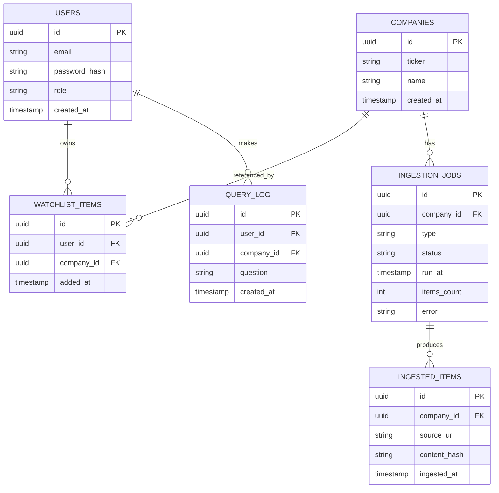

# Database

Cognivest uses **PostgreSQL** for operational/structured data only. The **memory, graph, and
vector schema is owned entirely by Cognee** and is *not* duplicated in Postgres — Postgres only
tracks *that* an item was ingested (hash, timestamp), never the graph content itself. See
[ARCHITECTURE.md §8](../ARCHITECTURE.md) and [memory-architecture.md](./memory-architecture.md).

Stack: **SQLAlchemy 2.x** (ORM) + **Alembic** (migrations). All SQL lives in
`backend/src/repositories/` — no SQL anywhere else (see [coding-standards.md](./coding-standards.md)).

## Operational schema (Postgres)

Reproduced from [ARCHITECTURE.md §4.5](../ARCHITECTURE.md):



### Table responsibilities

| Table | Purpose |
|---|---|
| `USERS` | accounts; `role` is `user` or `admin` (RBAC, see [authentication.md](./authentication.md)). |
| `COMPANIES` | watchlisted tickers (canonical company record). |
| `WATCHLIST_ITEMS` | join table — which user watches which company. |
| `INGESTION_JOBS` | each collector run (`type` = `price`/`news`), status, item count, error. |
| `INGESTED_ITEMS` | the **dedup hash table** — `content_hash` per source, checked before `cognee.add()`. |
| `QUERY_LOG` | audit of natural-language queries (for analytics + rate-limit context). |

> The six tables above match the SQLAlchemy models under `backend/src/models/`. A hashed
> refresh-token table is 🎯 roadmap (auth is a demo header today — see
> [authentication.md](./authentication.md)); it does not exist yet.

## Indexes

From [ARCHITECTURE.md §4.5](../ARCHITECTURE.md):

| Index | Purpose |
|---|---|
| `INGESTED_ITEMS(content_hash)` — unique per company | O(1) dedup checks before `cognee.add()`. |
| `INGESTION_JOBS(company_id, run_at)` | ingestion-health queries (`GET /admin/jobs`). |
| `COMPANIES(ticker)` — unique | one canonical record per ticker. |

The unique dedup index is the enforcement point for the **never skip the dedup hash check**
invariant ([CLAUDE.md §14](../CLAUDE.md)).

## Migrations workflow

Migrations are managed with Alembic and live under `backend/src/database/migrations/`.

```bash
# create a new migration after changing SQLAlchemy models
make migration m="add refresh_tokens table"   # alembic revision --autogenerate -m "..."

# review the generated file under backend/src/database/migrations/, then apply
make migrate                                   # alembic upgrade head
```

Rules:

- **Always review autogenerated migrations** — Alembic does not catch everything (e.g. data
  migrations, column renames it sees as drop+add).
- One logical change per migration; descriptive message.
- Never edit an already-applied migration; add a new one.
- Run `make migrate` after `make up`. (The initial schema migration is committed under
  `backend/src/database/migrations/versions/`.)

## What is *not* in Postgres

- Knowledge-graph entities/relationships → **Cognee graph store**.
- Embeddings / vector index → **Cognee vector store**.
- Per-company memory → Cognee dataset `company_{ticker}`.

Postgres records that ingestion happened (`INGESTED_ITEMS`, `INGESTION_JOBS`); the content lives in
Cognee. See [memory-architecture.md](./memory-architecture.md).
