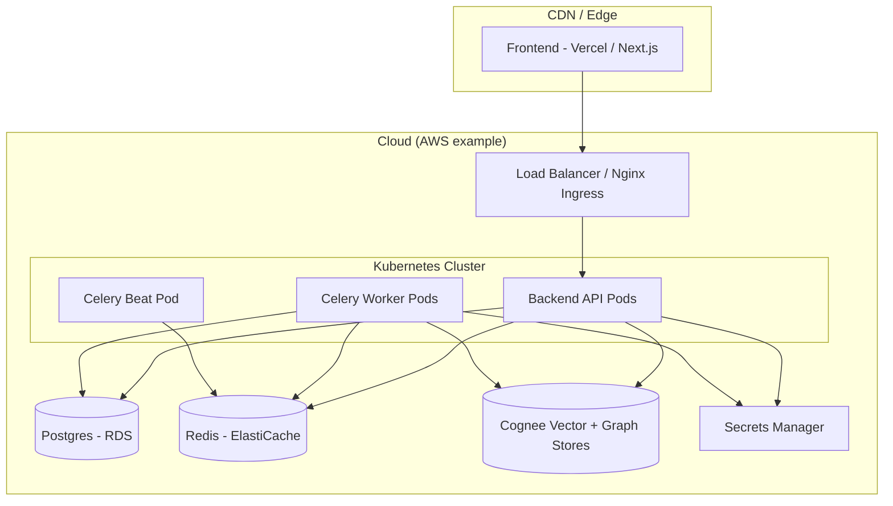

# Deployment

Two paths: the **production path** (Vercel + Kubernetes/Helm + Terraform-provisioned managed
services) and a **lightweight MVP path** (Railway/Render). Derived from
[ARCHITECTURE.md §10](../ARCHITECTURE.md).

## Production topology



### Frontend — Vercel

Deployed on Vercel: native Next.js support, edge caching, preview deployments per PR. Auto-deploys
on merge to `main`. Configure `NEXT_PUBLIC_API_BASE_URL` to point at the backend `/api/v1`.

### Backend + workers — Kubernetes / Helm

Backend API, Celery workers, and Celery Beat are containerized (Docker, see [`docker/`](./folder-structure.md))
and deployed to Kubernetes (EKS/GKE/AKS) via **Helm charts** in [`infrastructure/`](./folder-structure.md):

- **API pods** — FastAPI behind the ingress; horizontally scalable (HPA).
- **Worker pods** — Celery workers for the `price`, `news`, `cognify` queues; scale independently.
- **Beat pod** — a single Celery Beat scheduler (Beat must not be replicated).
- **Nginx / Ingress** — TLS termination, routing, edge rate limiting.

### Managed services — Terraform

[`infrastructure/`](./folder-structure.md) Terraform provisions:

- **Postgres** — managed RDS / Cloud SQL (the operational store, see [database.md](./database.md)).
- **Redis** — managed ElastiCache / Memorystore (Celery broker + cache).
- **Cognee stores** — the configured vector + graph backends, reachable only from the backend's
  private network (see [`cognee/config/README.md`](../cognee/config/README.md)).
- **Secrets** — AWS Secrets Manager / GCP Secret Manager for all API keys + JWT keys, injected as
  env vars at pod startup, **never committed**. See [authentication.md](./authentication.md) and
  [environment.md](./environment.md).

The `/memory/*` endpoints are internal-only and live on a private subnet (see
[authentication.md](./authentication.md)).

## CI/CD — GitHub Actions

Pipeline (defined under [`.github/`](./folder-structure.md) and [`deployment/`](./folder-structure.md)):

```text
push / PR
  → lint  (ruff + black --check + mypy ; eslint + prettier --check)
  → type  (mypy ; tsc --noEmit)
  → test  (pytest ; pnpm test)
  → build images → push to registry
  → deploy via Helm / ArgoCD (backend)   |   Vercel auto-deploys (frontend)
```

Migrations (`alembic upgrade head`) run before the app starts. CI must be green before merge. See
[development-workflow.md](./development-workflow.md).

## Lightweight MVP path (Railway / Render)

For an MVP without Kubernetes:

- **Railway or Render** hosts the backend API, a Celery worker, Celery Beat, **Postgres**, and
  **Redis** as managed add-ons.
- **Vercel** hosts the frontend (unchanged).
- Secrets are set as platform environment variables (still never committed).
- Same images, same migrations, same `.env` contract — just a simpler orchestrator.

This path trades fine-grained scaling/observability for speed of setup; the production path is the
target for scale-out and hardening (roadmap phases 6–7, see [roadmap.md](./roadmap.md)).

## Operational readiness

Once deployed, on-call uses the [runbooks](./runbooks/README.md):
[ingestion failure](./runbooks/ingestion-failure.md),
[cognify backlog](./runbooks/cognify-backlog.md),
[high query latency](./runbooks/high-query-latency.md).
