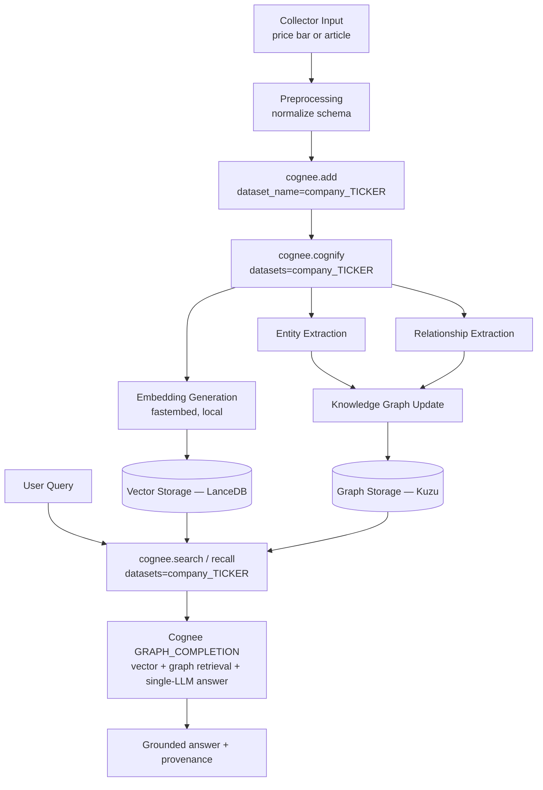
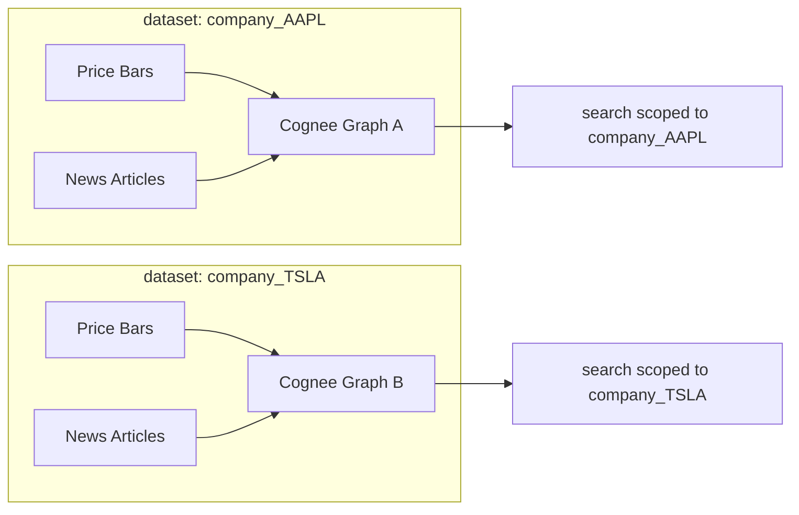
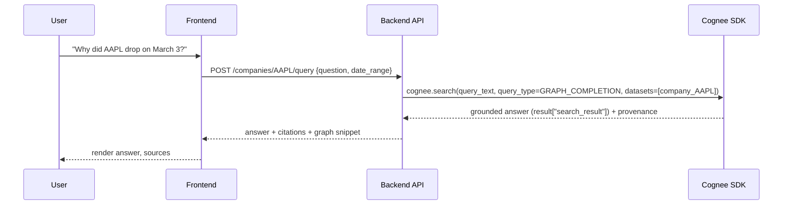

# Memory Architecture — the Cognee deep-dive

This is the most important document in the repository. **Cognee is the only memory/intelligence
layer.** There is intentionally **no** separate recall service, reranker, summarizer, or embedding
pipeline built on top of it — `add()`, `cognify()`, and `search()` / `recall()` are the entire
pipeline. Everything the backend does around them is orchestration (dataset naming, citation
formatting, and — on the roadmap — scheduling and dedup), **not** reimplementation.

Implemented against **cognee 1.2.2** (pinned). Every signature below is the spike-verified shape from
[spike-cognee-1.2.2.md](./spike-cognee-1.2.2.md) §2. Derived from [ARCHITECTURE.md §5](../ARCHITECTURE.md)
and [CLAUDE.md §7](../CLAUDE.md).

## The single-seam rule ✅

```python
# The ONLY module allowed to import the Cognee SDK is backend/src/memory/cognee_client.py.
dataset = dataset_name(ticker)                       # -> f"company_{ticker}"

await cognee.add(content, dataset_name=dataset)      # add: dataset_name= (singular str)
await cognee.cognify(datasets=[dataset])             # cognify: datasets= (str | list)

results = await cognee.search(                       # search: NO dataset_name, NO filters
    query_text=query,
    query_type=SearchType.GRAPH_COMPLETION,
    datasets=[dataset],
    top_k=top_k,
)

await cognee.forget(dataset=dataset)                 # purge: forget() — delete() is deprecated
```

> ⚠️ **API-shape gotcha (spike CONTRADICTION #1):** in 1.2.2, `search()` takes `datasets=` (plural)
> and has **no** `dataset_name=` and **no** `filters=` parameter. `add()` *does* still use
> `dataset_name=`, so the two calls are deliberately asymmetric. Code written against
> `search(dataset_name=…, filters=…)` will `TypeError`. Date filtering is not a top-level arg — it
> would go through query semantics / `TEMPORAL` search.

- The Cognee SDK is imported in **exactly one module**: `backend/src/memory/cognee_client.py`.
- All callers go through `backend/src/services/memory_service.py`, which wraps that client.
- This makes Cognee **mockable** in tests and **swappable** in config without touching callers.
- **Never** import the Cognee SDK anywhere else; **never** reimplement what Cognee owns; **never**
  cross-query datasets. See [CLAUDE.md §14](../CLAUDE.md).

## The add → cognify → search pipeline



1. **`cognee.add(content, dataset_name="company_{ticker}")`** — ingest a normalized item (price
   summary or article) into the company's dataset. ✅ (seam)
2. **`cognee.cognify(datasets=["company_{ticker}"])`** — Cognee performs entity extraction,
   relationship extraction, embedding generation (via **fastembed**, local), and graph linking. ✅ (seam)
3. **`cognee.search()` / `recall()`** — at query time, scoped to the dataset, combining vector
   similarity + graph traversal + Cognee's internal reranking, and producing the answer via
   `GRAPH_COMPLETION` (single-LLM, **Gemini**). ✅ (seam + the live `/query` route)

> 🎯 **Roadmap:** dedup before `add()` (content hash in Postgres `ingested_items`) and decoupling
> `cognify()` onto its own Celery queue are designed but **not built** — the collector path is a stub
> and the demo calls `cognify()` inline. See [backend.md](./backend.md).

## Per-company dataset isolation ✅

**One Cognee dataset per ticker: `company_{ticker}`.** Price summaries **and** news land in the
**same** dataset per ticker, so the graph can correlate price movements with narrative events.
Queries are naturally scoped — we never query across datasets.



The naming convention is centralized in `backend/src/memory/dataset_naming.py`
(`dataset_name(ticker) -> f"company_{ticker}"`) and documented in
[`cognee/datasets/README.md`](../cognee/datasets/README.md).

## Memory types (as used here)

Cognee provides these conceptually; we map our data onto them:

| Type | What it is in Cognivest |
|---|---|
| **Episodic memory** | Individual ingested articles / price events — time-stamped, source-attributed. |
| **Semantic memory** | The consolidated entity/relationship graph distilled from many episodes. |
| **Working memory** | The context assembled **per-query** from top-ranked retrieval results. |
| **Long-term memory** | The persistent vector + graph store across all historical ingestion. |

Supporting Cognee components (all internal to Cognee, not custom code): Knowledge Graph Builder,
Vector Store, Graph Database, Embedding Generator, Context Retriever / Semantic Search, Memory
Ranking, Entity Linking. See [ARCHITECTURE.md §5.2](../ARCHITECTURE.md).

## Memory storage

- **Vector store (LanceDB):** embeddings of every ingested chunk, namespaced per dataset. Embeddings
  are computed **locally** by fastembed (384-dim) at `cognify()` time — not regenerated per query.
- **Graph store (Kuzu):** entities and relationships, namespaced per dataset.
- **Provenance/citations:** Cognee 1.2.2's `add()` takes no `metadata` kwarg, so citation fields
  (`source_url`, `published_at`, …) are embedded as a delimited **provenance header** at the top of
  the ingested text and recovered from results (see the seam's `_with_provenance`).

The vector + graph backends are **Cognee configuration** (LanceDB + Kuzu are the verified defaults),
abstracted from the app.

## Retrieval pipeline



1. **Query** — backend passes the raw question + scope (`datasets=`) to `cognee.search()`.
2. **Embedding** — Cognee embeds the query with the same fastembed model used at ingestion.
3. **Similarity search** — top-k chunks from the vector store within the scoped dataset.
4. **Graph traversal** — related entities/edges pulled in.
5. **Reranking** — Cognee's internal ranking (vector similarity + graph relevance).
6. **Answer** — Cognee's `GRAPH_COMPLETION` returns the grounded answer directly (single-LLM, Gemini).
   The answer text lives in `result["search_result"]` (a `list[str]`). There is **no** separate
   answer-formatter LLM call. See [prompting.md](./prompting.md).

## Memory lifecycle

| Stage | Behavior | Status |
|---|---|---|
| **Creation** | `add()` + `cognify()` from the ingestion path. | seam ✅ / collector path 🎯 |
| **Recall** | `search()` / `recall()` scoped to the dataset. | ✅ (live `/query`) |
| **Improvement** | `improve()` folds answer feedback into graph weights (`FeedbackEntry`). | Cognee supports it (spike §2); **seam wiring 🎯** |
| **Deletion** | Whole-ticker purge via `forget(dataset="company_{ticker}")`. `DELETE /companies/{ticker}` would remove only the watchlist entry; purging memory is a separate admin action. | seam ✅ / routes 🎯 |
| **Consolidation / forgetting** | Periodic `cognify()`/reflection passes and TTL pruning. | 🎯 (Cognee capability, not scheduled) |

## Backend wrapper surface

The `/memory/*` endpoints are the intended internal wrapper over the seam. **The routes are stubs
today** (`NotImplementedError`); the seam methods they will call are implemented:

```text
POST   /memory/store      → cognee.add(dataset_name=…) then cognee.cognify(datasets=[…])
POST   /memory/search     → cognee.search(query_text=…, query_type=GRAPH_COMPLETION, datasets=[…])
POST   /memory/context    → assembled context block for the query path
POST   /memory/reflection → consolidation / cognify pass
DELETE /memory/delete     → cognee.forget(dataset="company_{ticker}")
```

See [authentication.md](./authentication.md) (the `/memory/*` guard is a no-op in the demo) and
[api.md](./api.md).

## Why this design

- **Mockability:** one seam → unit tests mock `memory_service` and never touch real Cognee.
- **Swappability:** Cognee vector/graph/LLM backends are config, changeable without touching callers.
- **Isolation:** per-ticker datasets prevent cross-tenant graph leakage.
- **Cost:** local fastembed embeddings (no embedding API); dedup before `add()` on the roadmap.
