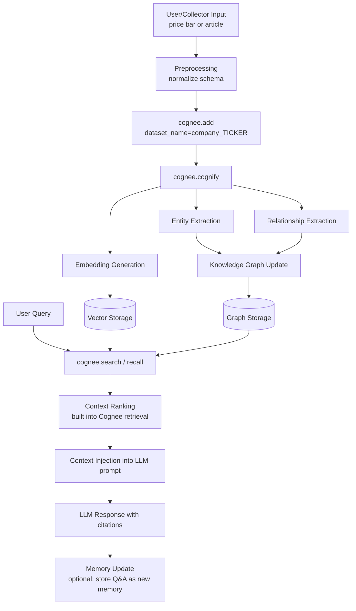
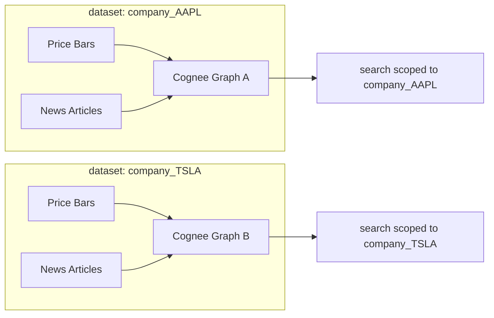
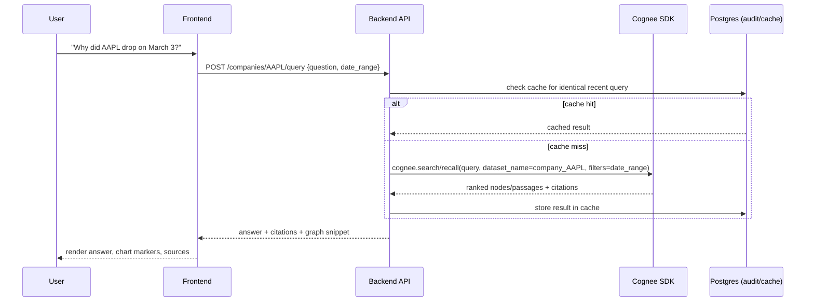

# Memory Architecture — the Cognee deep-dive

This is the most important document in the repository. **Cognee is the only memory/intelligence
layer.** There is intentionally **no** separate recall service, reranker, summarizer, or embedding
pipeline built on top of it — `add()`, `cognify()`, and `search()` / `recall()` are the entire
pipeline. Everything the backend does around them is orchestration (scheduling, dedup, dataset
naming, citation formatting), **not** reimplementation.

Derived from [ARCHITECTURE.md §5](../ARCHITECTURE.md), [§2.11](../ARCHITECTURE.md), and
[CLAUDE.md §7](../CLAUDE.md).

## The single-seam rule

```python
# The ONLY allowed Cognee call sites are inside backend/src/memory/cognee_client.py
dataset = dataset_name(ticker)            # -> f"company_{ticker}"
await cognee.add(content, dataset_name=dataset)
await cognee.cognify(datasets=[dataset])
results = await cognee.search(query, dataset_name=dataset, filters=date_range)
```

- The Cognee SDK is imported in **exactly one module**: `backend/src/memory/cognee_client.py`.
- All callers go through `backend/src/memory/memory_service.py`, which wraps that client.
- This makes Cognee **mockable** in tests and **swappable** in config without touching callers.
- **Never** import the Cognee SDK anywhere else; **never** reimplement what Cognee owns; **never**
  cross-query datasets. See [CLAUDE.md §14](../CLAUDE.md) and [tests/memory/](../tests/memory/README.md).

## The add → cognify → search pipeline



1. **`cognee.add(content, dataset_name="company_{ticker}")`** — ingest a normalized item (price
   summary text or article) into the company's dataset.
2. **`cognee.cognify(datasets=["company_{ticker}"])`** — Cognee performs entity extraction,
   relationship extraction, embedding generation, and graph linking. This is decoupled onto its own
   queue (see [backend.md](./backend.md)) so a slow cognify never blocks fetching.
3. **`cognee.search()` / `recall()`** — at query time, scoped to the dataset, combining vector
   similarity + graph traversal + Cognee's internal reranking.

Dedup happens **before** `add()` using a content hash stored in Postgres `ingested_items` (see
[database.md](./database.md)) — we never skip it.

## Per-company dataset isolation

**One Cognee dataset per ticker: `company_{ticker}`.** Price summaries **and** news land in the
**same** dataset per ticker, so the graph can correlate price movements with narrative events.
Queries are naturally scoped — we never query across datasets.



The naming convention is centralized in `backend/src/memory/dataset_naming.py`
(`dataset_name(ticker) -> f"company_{ticker}"`) and documented in
[`cognee/datasets/README.md`](../cognee/datasets/README.md). Isolation is asserted by contract tests
in [`tests/memory/test_dataset_isolation.py`](../tests/memory/test_dataset_isolation.py).

## Memory types (as used here)

Cognee provides these conceptually; we map our data onto them:

| Type | What it is in Cognivest |
|---|---|
| **Episodic memory** | Individual ingested articles / price events — time-stamped, source-attributed. |
| **Semantic memory** | The consolidated entity/relationship graph distilled from many episodes. |
| **Working memory** | The context window assembled **per-query** from top-ranked retrieval results. |
| **Long-term memory** | The persistent vector + graph store across all historical ingestion. |

Supporting Cognee components (all internal to Cognee, not custom code): Knowledge Graph Builder,
Vector Store, Graph Database, Embedding Generator, Context Retriever / Semantic Search, Memory
Ranking, Entity Linking, Reflection Engine, Memory Consolidation. See
[ARCHITECTURE.md §5.2](../ARCHITECTURE.md).

## Memory storage

- **Vector store**: embeddings of every ingested chunk (price-summary text + article text),
  namespaced per dataset.
- **Graph store**: entities (`Company`, `Person`, `Product`, `Event`, `PriceMove`) and relationships
  (`MENTIONS`, `CAUSED_BY`, `COMPETES_WITH`, `REPORTED_BY`), namespaced per dataset.
- **Metadata** attached to each node/chunk: `source_url`, `published_at`, ticker, ingestion job id —
  used for **citations** and **date-range filtering**.
- **Embeddings** are generated by Cognee's configured embedding model at `cognify()` time, **not**
  regenerated per query.

The vector + graph backends are **Cognee configuration** (e.g. LanceDB/Weaviate for vectors,
Kuzu/Neo4j for graph), abstracted from the app. See [`cognee/config/README.md`](../cognee/config/README.md).

## Retrieval pipeline



Steps (from [ARCHITECTURE.md §5.5](../ARCHITECTURE.md)):

1. **Query understanding** — backend passes the raw question + scope (`dataset_name`, optional date
   filter) to `cognee.search()`.
2. **Embedding generation** — Cognee embeds the query with the same model used at ingestion.
3. **Similarity search** — top-k chunks from the vector store within the scoped dataset.
4. **Graph traversal** — related entities/edges pulled in.
5. **Context reranking** — Cognee's internal ranking (vector similarity + graph relevance + recency).
6. **Final prompt assembly** — `answer_formatter` builds the LLM prompt with citation placeholders
   and calls Claude. See [prompting.md](./prompting.md).

## Memory lifecycle

| Stage | Behavior |
|---|---|
| **Creation** | every successful `add()` + `cognify()` from the collector pipeline. |
| **Updates** | re-ingested corrected articles are treated as new content; the dedup hash blocks true duplicates; updated articles (different hash, same URL) are linked via Cognee entity linking. |
| **Deletion** | `DELETE /companies/{ticker}` removes the **watchlist** entry only; a separate explicit admin "purge memory" action calls Cognee's delete API (`DELETE /memory/delete`, or `scripts/purge_dataset.py`). |
| **Forgetting** | optional TTL-based pruning of low-relevance old episodic nodes — a scheduled consolidation job. |
| **Consolidation** | periodic `cognify()` / reflection passes merge duplicate entities and stale edges (`POST /memory/reflection`). |
| **Compression** | long-tail, low-relevance episodic content summarized into semantic-memory nodes during consolidation. |

## Backend wrapper surface

The `/memory/*` endpoints (internal-only; see [authentication.md](./authentication.md) and
[api.md](./api.md)):

```text
POST   /memory/store      → cognee.add(content, dataset_name=f"company_{ticker}") then cognee.cognify()
POST   /memory/search     → cognee.search()/recall(dataset_name=..., query=..., filters=...)
POST   /memory/context    → assembled context block (chunks + graph snippet) for LLM prompt injection
POST   /memory/reflection → consolidation/cognify pass to merge duplicate entities
DELETE /memory/delete     → admin-only; removes a dataset or a date-bounded slice
```

## Why this design

- **Mockability**: one seam → unit tests mock `memory_service` and never touch real Cognee.
- **Swappability**: Cognee vector/graph backends are config, changeable without touching callers.
- **Isolation**: per-ticker datasets prevent cross-tenant graph leakage (a security control, see
  [ARCHITECTURE.md §11](../ARCHITECTURE.md)).
- **Cost control**: dedup before `add()`; embeddings cached at `cognify()` time; cognify decoupled
  onto its own queue.
