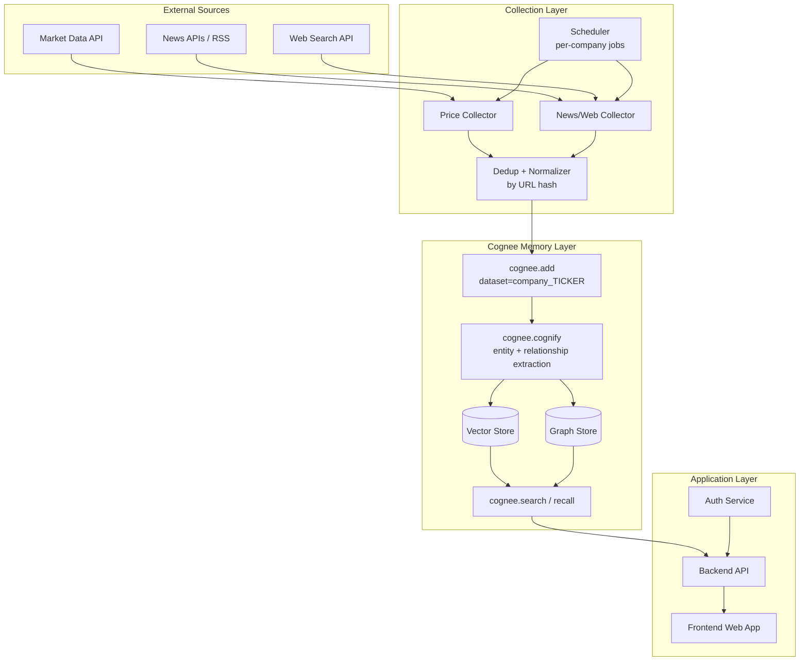
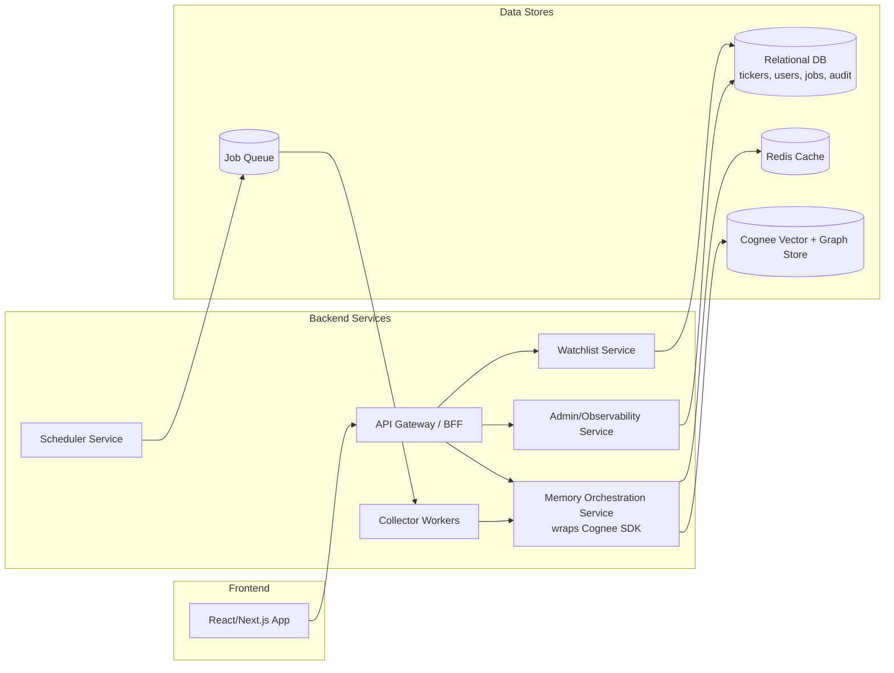

# System Design — overview

A condensed overview of Cognivest. The exhaustive design is in
[ARCHITECTURE.md](../ARCHITECTURE.md) (the single source of truth); this page is a map into it.

## What it is

Cognivest continuously gathers two streams per company — **structured price data** and
**unstructured web/news content** — and feeds both into **Cognee** as a unified memory layer. Cognee
owns ingestion (`add()`), knowledge-graph construction (`cognify()`), and retrieval (`search()` /
`recall()`). The app is a **thin orchestration + presentation shell** around it: collection,
scheduling, dedup, dataset scoping, citation formatting, auth, and UI.

Users ask natural-language questions scoped to a company and date range
(*"Why did $AAPL drop on March 3?"*) and get **ranked, cited** answers.

## High-level architecture

## Component view

## Stack at a glance

| Layer | Technology |
|---|---|
| Frontend | Next.js 14, TypeScript, Tailwind + shadcn/ui, TanStack Query, Zustand, Recharts, Axios |
| Backend | Python 3.11, FastAPI, Pydantic v2, SQLAlchemy 2.x + Alembic |
| Workers | Celery + Redis broker, Celery Beat (queues: `price`, `news`, `cognify`) |
| Memory / AI | Cognee SDK + Anthropic Claude (answer generation) |
| Data | PostgreSQL, Redis, Cognee-managed vector + graph stores |

## Key invariants

- **Cognee is a single seam** — imported only in `backend/src/memory/cognee_client.py`.
- **One dataset per ticker** — `company_{ticker}`; price + news share it; never cross-query.
- **Auth secures the app layer only**; Cognee is internal + network-isolated.
- **Retrieved content is data, not instructions** (prompt-injection guard).

## Where to go next

| Topic | Doc |
|---|---|
| The Cognee memory layer | [memory-architecture.md](./memory-architecture.md) |
| Backend layers & workers | [backend.md](./backend.md) |
| Frontend structure | [frontend.md](./frontend.md) |
| API reference | [api.md](./api.md) |
| Database schema | [database.md](./database.md) |
| Auth model | [authentication.md](./authentication.md) |
| Deployment | [deployment.md](./deployment.md) |
| Roadmap | [roadmap.md](./roadmap.md) |
